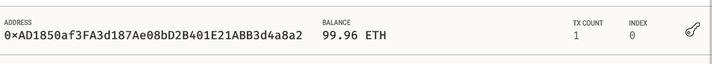
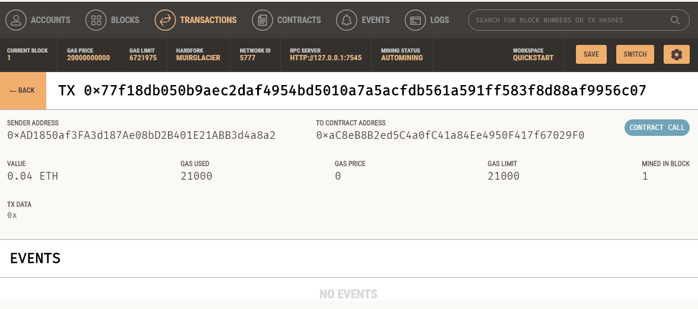

# Fintech Finder


-----------
# Overview

A web-based platform that provides an interface to hire and compensate a Fintech professional in Crypto (Ether). It provides list of professionals with hourly rate and their wallet address for payments. User can enter the number of hours worked by a professional and the app will automatically calculate the ETH amount to transfer. 

# Technologies

Python is the primary language used to code this application. Streamlit library is utilized to provide a web interface. Dataclass and Typing libraries are used to create dataclass and input manipulations. Finally, Web3 and Ganache libraries used to interact with mock Ethereum blockchain and to record transactions.

This project leverages python 3.7 with the following packages:

* [Streamlit](https://docs.streamlit.io/library/get-started) - Streamlit turns data scripts into shareable web apps
* [DataClasses](https://docs.python.org/3/library/dataclasses.html) - It provides a decorator and functions for automatically adding generated special methods 
* [Typing](https://docs.python.org/3/library/typing.html) -  This module provides runtime support for type hints
* [Hashlib](https://docs.python.org/3/library/pathlib.html) - This module implements a common interface to many different secure hash and message digest algorithms (e.g., SHA256)
* [web3](https://pypi.org/project/web3/) - A Python library for interacting with Ethereum, inspired by web3.js.
* [Ganache](https://trufflesuite.com/docs/ganache/) - Ganache is a personal blockchain for rapid Ethereum and Corda distributed application development. 

## Installation Guide

Before running the application first install the following dependencies.

```python
  pip install streamlit
  pip install web3
  Download Ganache (UI verison)
  
```

## Usage

Use the following command to run the app

```git to the directory and type
 Streamlit run pychain.py
 
```

```Desktop
 Run Ganache in quick start mode
 
```

---
## Screenshots
Account screen in Ganache



----
Transaction and block hashes 





----

## Contributors

Azam Jiva

---

## License

MIT
